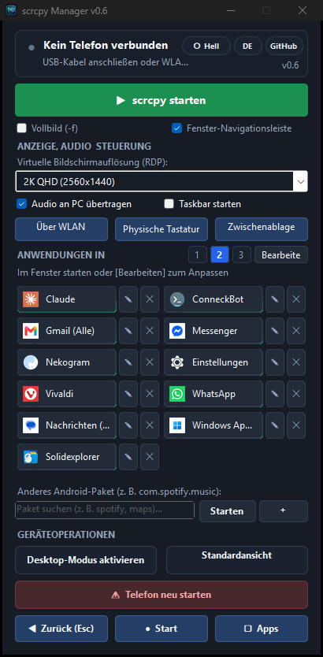

# scrcpy Manager 📱🖥️

> **Universeller Windows Desktop-Begleiter für `scrcpy` und Android Power-User.**  
> Starten Sie Android-Apps in separaten Fenstern, verwalten Sie virtuelle Bildschirme, wechseln Sie zu kabellosem ADB (WLAN), verhindern Sie den Ruhezustand und optimieren Sie Remote-Desktop-Workflows (RDP).

<p align="center">
  <b>🌐 Language / Język / Sprache / Idioma:</b><br>
  <a href="README.md">🇬🇧 English</a> &nbsp;|&nbsp;
  <a href="README.pl.md">🇵🇱 Polski</a> &nbsp;|&nbsp;
  <b><a href="README.de.md">🇩🇪 Deutsch</a></b> &nbsp;|&nbsp;
  <a href="README.es.md">🇪🇸 Español</a>
</p>

<p align="center">
  
  <a href="https://github.com/Genymobile/scrcpy"></a>
  <a href="https://github.com/tomaasz/scrcpy-manager/releases"></a>
  <a href="LICENSE"></a>
  
</p>

<p align="center">
  
</p>

---

## ⚡ Sofortiger Download (Portable Edition)

👉 **[ScrcpyManager-Portable.exe herunterladen (Neuestes Release)](https://github.com/tomaasz/scrcpy-manager/releases)**

* **Keine Installation & keine Abhängigkeiten**: Enthält `scrcpy v4.1`, Android Debug Bridge (`adb`) und alle erforderlichen Bibliotheken in einer einzigen Datei.
* **Sofort einsatzbereit**: Läuft auf jedem Windows 10/11 PC ohne vorherige Installation von `scrcpy` oder Anpassung von `PATH`.
* **Kein Konsolenfenster**: Saubere native Benutzeroberfläche ohne störende schwarze Konsolenfenster.
* **Blitzschneller Start**: Die versionierte, mit SHA-256 verifizierte Runtime startet in unter 0,2 Sekunden.

---

## 🌟 Hauptfunktionen

* 🚀 **Multi-Window Apps**: Starten Sie beliebige Android-Apps in separaten, schwebenden Fenstern (`--new-display`).
* 🎨 **Dedizierte App-Symbole in Windows**: Jedes geöffnete App-Fenster erhält sein offizielles Icon in der Windows-Taskleiste und in Alt+Tab anstelle des Standard-Robotersymbols von `scrcpy`.
* 🖥️ **Modernes, überarbeitetes Design**: Elegantes Graphit-Design mit abgerundeten Ecken, kantenglatter Darstellung und dezenten Hover-Effekten.
* ⚙️ **Profile pro App**: Speichern Sie Auflösung/DPI, FPS, Bitrate, Codec, Ausrichtung, Tastatur, Maus, Audio, Vollbild, rahmenloses Fenster und Taskbar-Sichtbarkeit für jede Kachel.
* 🎛️ **Vorkonfigurierte Voreinstellungen**: Standard, Arbeit/RDP, Terminal (hohe DPI für optimale Lesbarkeit), Gaming, WLAN-Sparmodus und Präsentation.
* 🛡️ **Android Taskbar-Steuerung & Installer**: Optionales Ausblenden der Taskleiste (`--no-vd-system-decorations`), damit maximierte Fenster nicht verdeckt werden, sowie automatische Erkennung und 1-Klick-Installation der offiziellen Taskbar-App via ADB.
* 🎥 **Sitzungsaufzeichnung**: Zeichnen Sie ausgewählte App-Sitzungen als MP4-Dateien mit Zeitstempel im Ordner `Videos\scrcpy-manager` auf.
* 🔎 **Echtzeit-Paketsuche**: Schnelles Filtern und Durchsuchen der auf dem Smartphone installierten Apps.
* 📶 **Kabelloses ADB (WLAN) mit einem Klick**: Automatische IP-Erkennung im Heimnetzwerk und nahtloses Umschalten von USB auf WLAN.
* 🔊 **Audio-Weiterleitung**: Bequemer Schalter zur Weiterleitung des Tons an PC-Lautsprecher oder Kopfhörer.
* ⌨️ **Physische Tastatur & Maus (UHID)**: Vollständige Unterstützung für Sonderzeichen und AltGr-Kürzel (`-K`) sowie Hardware-Maus-Emulation (`--mouse=uhid`, `-ForwardAllClicks`) für einfache Textauswahl und Kopieren.
* 🖥️ **Optimierte RDP-Profile (Windows App)**:
  * `Full HD 1080p (Nativ 1:1)` – Pixelgenaue Schärfe.
  * `2K QHD (2560x1440)` – 77 % mehr Arbeitsfläche.
  * `4K UHD (3840x2160)` – Maximale Übersicht für große Monitore.
  * *Hohe Bitrate (16 Mbps)* für gestochen scharfe Schriftarten.
* 🔙 **Bequeme Navigation & ESC-Taste**: Das Drücken der `ESC`-Taste in einem App-Fenster löst sofort `Zurück` aus (wie der Pfeil `←` in der App).
* 🧭 **Angedockte Fenster-Navigationsleiste**: Schwebende Leiste mit `◀` (Zurück), `●` (Startseite) und `▢` (Verlauf) am unteren Fensterrand.
* 📱 **Navigationsleiste im Manager**: Schnelle Steuerung des Telefons (`◀ Zurück`, `● Home`, `▢ Letzte Apps`) direkt im Dashboard.
* 📐 **Flexible Kachel-Layouts**: Wählen Sie zwischen 1-spaltiger Liste, 2-spaltigem Standard und 3-spaltiger Kompaktansicht.
* 🌓 **Dunkel- und Hellmodus**: Schneller Wechsel des Erscheinungsbildes mit einem Klick.
* 🌐 **Mehrsprachig (4 Sprachen)**: Sofortiges Umschalten zwischen Polnisch, Englisch, Deutsch und Spanisch.
* 🔄 **In-App-Aktualisierungen & Versionsprüfung**: Automatische Suche nach neuen Versionen beim Start, Anzeige von Änderungsprotokollen und 1-Klick-Aktualisierung mit SHA-256-Verifizierung.
* 🔌 **Interaktive Verbindungsanleitung & ADB-Selbstreparatur**: 3-Schritte-Assistent für die Ersteinrichtung (Entwickleroptionen, USB-Debugging, RSA-Autorisierung), Hardware-Tipps, Verknüpfung zum Geräte-Manager und automatische Wiederherstellung bei hängendem ADB-Server.
* 🔋 **Echtzeit-Statuskarte & GitHub-Schaltfläche**: Verbindungsstatus, Akkuladestand mit Ladeanzeige, Wachmodus-Monitor, direkter Link zum GitHub-Repository und manuelle Versionsprüfung.

---

## 🚀 Schnellstart (Ausführen aus dem Quellcode)

Wenn Sie das Skript direkt ausführen möchten, anstatt die portable `.exe` zu verwenden:

### Voraussetzungen
1. **Windows 10 / 11** (PowerShell 5.1 oder PowerShell 7+)
2. **[scrcpy](https://github.com/Genymobile/scrcpy)** (v2.0 oder neuer) & **adb** im System-`PATH` verfügbar
3. Android-Gerät mit aktiviertem **USB-Debugging**

### Anleitung
1. Repository klonen:
   ```bash
   git clone https://github.com/tomaasz/scrcpy-manager.git
   cd scrcpy-manager
   ```
2. Doppelklick auf `ScrcpyApp.cmd` oder Start in PowerShell:
   ```powershell
   & .\ScrcpyApp.ps1
   ```

---

## ⚙️ Anpassen der App-Schaltflächen (`apps.json`)

`apps.json` definiert das standardmäßige Kachellayout. Sie können auch die Schaltfläche **Bearbeiten** in der App verwenden, um Anwendungen vom Telefon zu laden, hinzuzufügen, umzubenennen und neu anzuordnen. Benutzerdefinierte Einstellungen werden unter `%APPDATA%\scrcpy-manager\apps.json` gespeichert.

```json
[
  {
    "name": "Messenger",
    "package": "com.facebook.orca",
    "flags": []
  },
  {
    "name": "Spotify",
    "package": "com.spotify.music",
    "flags": []
  },
  {
    "name": "Windows App (RDP)",
    "package": "com.microsoft.rdc.androidx",
    "flags": ["-UseUhidKeyboard", "-UseUhidMouse", "-ForwardAllClicks"]
  }
]
```

---

## 🙏 Danksagung & Verwendete Software

Dieses Projekt basiert auf folgenden Open-Source-Lösungen:

* **[scrcpy](https://github.com/Genymobile/scrcpy)** von [Romain Vimont (@rom1v)](https://github.com/rom1v) & [Genymobile](https://github.com/Genymobile) (Apache License 2.0)
* **[Android Debug Bridge (ADB)](https://developer.android.com/tools/adb)** von Google & AOSP (Apache License 2.0)
* **[Taskbar](https://github.com/farmerbb/Taskbar)** von [Braden Farmer (farmerbb)](https://github.com/farmerbb) (Apache License 2.0)
* **[Windows Forms CueBanner](https://learn.microsoft.com/en-us/windows/win32/controls/em-setcuebanner)** von Microsoft
* **[Google Play Store API](https://play.google.com)** für Vektorsymbole

---

## 📜 Lizenz

Dieses Projekt ist unter der **MIT-Lizenz** lizenziert. Weitere Informationen finden Sie in der [LICENSE](LICENSE)-Datei.