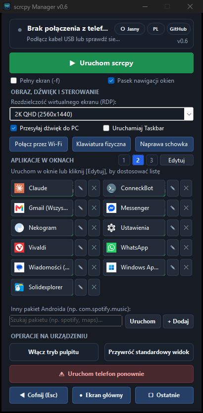

# scrcpy Manager 📱🖥️

> **Universeller Windows Desktop-Begleiter für `scrcpy` und Android Power-User.**  
> Starten Sie Android-Apps in separaten Fenstern, verwalten Sie virtuelle Bildschirme, wechseln Sie zu kabellosem ADB (WLAN) und optimieren Sie Remote-Desktop-Workflows.

  <b>🌐 Language / Język / Sprache / Idioma:</b> 
  <a href="README.md">🇬🇧 English</a> &nbsp;|&nbsp;
  <a href="README.pl.md">🇵🇱 Polski</a> &nbsp;|&nbsp;
  <b><a href="README.de.md">🇩🇪 Deutsch</a></b> &nbsp;|&nbsp;
  <a href="README.es.md">🇪🇸 Español</a>

  
  
  
  
  

  

---

## ⚡ Sofortiger Download (Portable Edition)

👉 **[ScrcpyManager-Portable.exe herunterladen (Neuestes Release)](https://github.com/tomaasz/scrcpy-manager/releases)**

* **Keine Installation & keine Abhängigkeiten**: Enthält `scrcpy v4.1`, Android Debug Bridge (`adb`) und alle erforderlichen Bibliotheken in einer einzigen Datei.
* **Sofort einsatzbereit**: Läuft auf jedem Windows 10/11 PC ohne vorherige Installation von `scrcpy` oder Anpassung von `PATH`.
* **Kein Konsolenfenster**: Saubere native Benutzeroberfläche ohne störende schwarze Konsolenfenster.

---

## 🌟 Hauptfunktionen

* 🚀 **Multi-Window Apps**: Starten Sie beliebige Android-Apps in separaten, schwebenden Fenstern (`--new-display`).
* 🎨 **Echte App-Symbole**: Extrahiert offizielle App-Icons direkt vom Telefon und Google Play für Ihre Kacheln.
* 🔎 **Echtzeit-Paketsuche**: Schnelles Filtern und Durchsuchen der auf dem Smartphone installierten Apps.
* 📶 **Kabelloses ADB (WLAN) mit einem Klick**: Automatische IP-Erkennung im Heimnetzwerk und Umschalten auf WLAN-Debugging.
* 🔊 **Audio-Weiterleitung**: Bequemer Schalter zur Weiterleitung des Tons an PC-Lautsprecher oder Kopfhörer.
* ⌨️ **Physische Tastatur (UHID)**: Vollständige Unterstützung für Sonderzeichen und Tastenkürzel (`-K`).
* 🖥️ **Optimierte RDP-Profile (Windows App)**: Vorkonfigurierte Auflösungen für Full HD, 2K QHD und 4K UHD mit 16 Mbps Bitrate.
* 📐 **Flexible Kachel-Layouts**: Wählen Sie zwischen 1-spaltiger Liste, 2-spaltigem Standard und 3-spaltiger Kompaktansicht.
* 🌓 **Dunkel- und Hellmodus**: Schneller Wechsel des Erscheinungsbildes mit einem Klick.
* 🌐 **Mehrsprachig (4 Sprachen)**: Sofortiges Umschalten zwischen Polnisch, Englisch, Deutsch und Spanisch.
* 🔄 **In-App-Aktualisierungen**: 1-Klick-Erkennung neuer Versionen und nahtloses Upgrade der Portable-Edition.

---

## 🙏 Danksagung & Verwendete Software

Dieses Projekt basiert auf folgenden Open-Source-Lösungen:

* **[scrcpy](https://github.com/Genymobile/scrcpy)** von [Romain Vimont (@rom1v)](https://github.com/rom1v) & [Genymobile](https://github.com/Genymobile) (Apache License 2.0)
* **[Android Debug Bridge (ADB)](https://developer.android.com/tools/adb)** von Google & AOSP (Apache License 2.0)
* **[Taskbar](https://github.com/farmerbb/Taskbar)** von [Braden Farmer (farmerbb)](https://github.com/farmerbb) (Apache License 2.0)
* **[Windows Forms CueBanner](https://learn.microsoft.com/en-us/windows/win32/controls/em-setcuebanner)** von Microsoft

---

## 📜 Lizenz

Dieses Projekt ist unter der **MIT-Lizenz** lizenziert. Weitere Informationen finden Sie in der [LICENSE](LICENSE)-Datei.