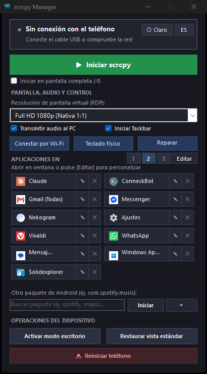

# scrcpy Manager 📱🖥️

> **Compañero de escritorio universal para `scrcpy` y usuarios avanzados de Android.**  
> Abra aplicaciones de Android en ventanas flotantes independientes, gestione pantallas virtuales, conéctese de forma inalámbrica por Wi‑Fi (ADB) y optimice flujos de trabajo de Escritorio Remoto (RDP).

  <b>🌐 Language / Język / Sprache / Idioma:</b> 
  <a href="README.md">🇬🇧 English</a> &nbsp;|&nbsp;
  <a href="README.pl.md">🇵🇱 Polski</a> &nbsp;|&nbsp;
  <a href="README.de.md">🇩🇪 Deutsch</a> &nbsp;|&nbsp;
  <b><a href="README.es.md">🇪🇸 Español</a></b>

  
  
  
  
  

  

---

## ⚡ Descarga Inmediata (Versión Portable)

👉 **[Descargar ScrcpyManager-Portable.exe (Última versión)](https://github.com/tomaasz/scrcpy-manager/releases)**

* **Cero instalación y sin dependencias**: Incluye `scrcpy v4.1`, Android Debug Bridge (`adb`) y todas las librerías necesarias en un único archivo ejecutable.
* **Listo para usar**: Funciona en cualquier equipo con Windows 10/11 sin necesidad de instalar previamente `scrcpy` ni configurar `PATH`.
* **Sin ventana de comandos**: Experiencia visual limpia sin ventanas de consola parpadeantes.

---

## 🌟 Características Principales

* 🚀 **Aplicaciones en ventanas flotantes**: Abra cualquier app de Android en una ventana virtual independiente (`--new-display`).
* 🎨 **Iconos nativos de aplicaciones**: Extrae los iconos oficiales directamente del teléfono y Google Play para sus botones de acceso directo.
* 🔎 **Búsqueda de paquetes en tiempo real**: Filtre rápidamente las apps instaladas en el dispositivo móvil.
* 📶 **ADB inalámbrico (Wi‑Fi) en un clic**: Detección automática de la IP del teléfono y cambio inmediato de USB a conexión inalámbrica.
* 🔊 **Control de audio**: Interruptor sencillo para redirigir el sonido del teléfono a los altavoces o auriculares del PC.
* ⌨️ **Teclado físico (UHID)**: Soporte completo para caracteres internacionales y atajos de teclado (`-K`).
* 🖥️ **Perfiles RDP optimizados**: Resoluciones para Full HD, 2K QHD y 4K UHD con tasa de 16 Mbps para máxima nitidez de texto.
* 📐 **Diseños de botones flexibles**: Cambie entre lista de 1 columna, vista de 2 columnas o modo compacto de 3 columnas.
* 🌓 **Modo Oscuro y Claro**: Cambio rápido de tema visual con un solo clic.
* 🌐 **Multilingüe (4 idiomas)**: Interfaz disponible en polaco, inglés, alemán y español con persistencia de preferencias.
* 🔄 **Actualizaciones automáticas integradas**: Detección de versiones y actualización en 1 clic de la edición portátil.

---

## 🙏 Créditos y Software de Terceros

Este proyecto se ha desarrollado gracias a las siguientes tecnologías y herramientas de código abierto:

* **[scrcpy](https://github.com/Genymobile/scrcpy)** creado por [Romain Vimont (@rom1v)](https://github.com/rom1v) y [Genymobile](https://github.com/Genymobile) (Licencia Apache 2.0)
* **[Android Debug Bridge (ADB)](https://developer.android.com/tools/adb)** por Google y AOSP (Licencia Apache 2.0)
* **[Taskbar](https://github.com/farmerbb/Taskbar)** por [Braden Farmer (farmerbb)](https://github.com/farmerbb) (Licencia Apache 2.0)
* **[Windows Forms CueBanner](https://learn.microsoft.com/en-us/windows/win32/controls/em-setcuebanner)** por Microsoft

---

## 📜 Licencia

Este proyecto se distribuye bajo los términos de la **Licencia MIT**. Consulte el archivo [LICENSE](LICENSE) para más detalles.