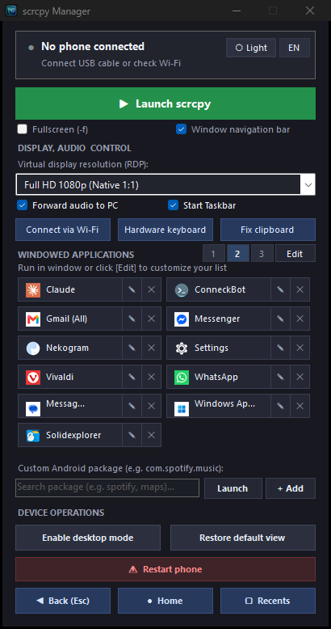

# scrcpy Manager 📱🖥️

> **Universal Windows desktop companion for `scrcpy` and Android power users.**  
> Launch Android apps in dedicated floating windows, manage virtual displays, switch seamlessly to Wireless ADB (Wi‑Fi), prevent screen sleep, and streamline Remote Desktop workflows.

<p align="center">
  <b>🌐 Language / Język / Sprache / Idioma:</b><br>
  <b><a href="README.md">🇬🇧 English</a></b> &nbsp;|&nbsp;
  <a href="README.pl.md">🇵🇱 Polski</a> &nbsp;|&nbsp;
  <a href="README.de.md">🇩🇪 Deutsch</a> &nbsp;|&nbsp;
  <a href="README.es.md">🇪🇸 Español</a>
</p>

<p align="center">
  
  <a href="https://github.com/Genymobile/scrcpy"></a>
  <a href="https://github.com/tomaasz/scrcpy-manager/releases"></a>
  <a href="LICENSE"></a>
  
</p>

<p align="center">
  
</p>

---

## ⚡ Instant Download (Portable Edition)

👉 **[Download ScrcpyManager-Portable.exe (Latest Release)](https://github.com/tomaasz/scrcpy-manager/releases)**

* **Zero setup & zero dependencies**: Bundles `scrcpy v4.1`, Android Debug Bridge (`adb`), and all required libraries inside a single standalone executable.
* **No installation**: Runs immediately on any Windows 10/11 computer without installing `scrcpy` or modifying system `PATH`.
* **Zero console window**: Clean native desktop GUI experience with no flashing command prompts.
* **Instant subsequent starts**: Cached runtime verified with MD5 hash starts in under 0.2s.

---

## 🌟 Key Features

* 🚀 **Multi-Window Floating Apps**: Launch any Android app in an independent virtual display window (`--new-display`).
* 🎨 **Native App Icons**: Extracts official application icons directly from your phone and Google Play, displaying crisp icons on your custom launch tiles.
* 🔎 **Real-Time Package Search**: Instant search and filtering when picking apps from your connected phone.
* 📶 **One-Click Wireless ADB (Wi‑Fi)**: Automatically detect your phone's Wi‑Fi IP and switch from USB cable to wireless debugging in one click.
* 🔊 **Audio Passthrough Control**: Toggle real-time audio forwarding from your Android device to PC speakers/headphones.
* ⌨️ **Hardware Keyboard (UHID) & Diacritics**: Full native support for international characters and AltGr shortcuts with direct hardware keyboard simulation (`-K`).
* 🖥️ **High-Resolution RDP Presets**:
  * `Full HD 1080p (Native 1:1)` – Pixel-sharp 1:1 scaling.
  * `2K QHD (2560x1440)` – +77% expanded desktop workspace.
  * `4K UHD (3840x2160)` – Maximum productivity view.
  * *High bitrate (16 Mbps)* enabled for razor-sharp text and fonts.
* 🔙 **Convenient Navigation & ESC Key**: Pressing `ESC` in any Android app window immediately triggers `Back` (just like clicking the app's top-left `←` arrow).
* 🧭 **Docked Window Navigation Bar**: Floating bottom bar with `◀` (Back), `●` (Home), and `▢` (Recents) seamlessly attached to scrcpy windows.
* 📱 **Dashboard Navigation Buttons**: Instant phone control (`◀ Back`, `● Home`, `▢ Recents`) right from the manager window.
* 📐 **Flexible Tile Layouts**: Switch between 1-column list, 2-column standard, and 3-column compact view with persistent user preferences.
* 🌓 **Dark & Light Mode**: 1-click theme switcher (`☀️ Light` / `🌙 Dark`) with smooth custom controls.
* 🌐 **Multilingual Interface**: 4 languages supported out of the box (🇵🇱 Polish, 🇬🇧 English, 🇩🇪 German, 🇪🇸 Spanish) with persistent preference.
* 🔄 **In-App Auto-Updates**: One-click update detection and seamless upgrading of the Portable edition.
* 🔋 **Real-Time Status Card**: Connection status dot, battery level with charging state, and keep-awake monitor.

---

## 🚀 Quick Start (Running from Source)

If you prefer running the script directly instead of downloading the portable `.exe`:

### Requirements
1. **Windows 10 / 11** (PowerShell 5.1 or PowerShell 7+)
2. **[scrcpy](https://github.com/Genymobile/scrcpy)** (v2.0 or newer) & **adb** available in system `PATH`
3. Android device with **USB Debugging** enabled

### Instructions
1. Clone the repository:
   ```bash
   git clone https://github.com/tomaasz/scrcpy-manager.git
   cd scrcpy-manager
   ```
2. Double-click `ScrcpyApp.cmd` or launch in PowerShell:
   ```powershell
   & .\ScrcpyApp.ps1
   ```

---

## ⚙️ Customizing App Buttons (`apps.json`)

`apps.json` defines the bundled default button layout. You can also use the in-app **Edit** button to load applications from your connected phone, add, remove, rename, and rearrange buttons. User customizations are safely preserved in `%APPDATA%\scrcpy-manager\apps.json`.

```json
[
  {
    "name": "Messenger",
    "package": "com.facebook.orca",
    "flags": []
  },
  {
    "name": "Spotify",
    "package": "com.spotify.music",
    "flags": []
  },
  {
    "name": "Windows App (RDP)",
    "package": "com.microsoft.rdc.androidx",
    "flags": ["-UseUhidKeyboard", "-ForwardAllClicks"]
  }
]
```

---

## 🙏 Credits & Acknowledgments

This project is built with gratitude upon the following incredible open-source projects and technologies:

* **[scrcpy](https://github.com/Genymobile/scrcpy)** by [Romain Vimont (@rom1v)](https://github.com/rom1v) & [Genymobile](https://github.com/Genymobile) (Apache License 2.0)  
  *The core mirroring engine providing ultra-low latency display streaming, virtual display creation, UHID hardware keyboard emulation, and audio passthrough.*
* **[Android Debug Bridge (ADB)](https://developer.android.com/tools/adb)** by Google & the Android Open Source Project (AOSP) (Apache License 2.0)  
  *The foundation for device discovery, shell commands, wireless debugging, and package query.*
* **[Taskbar](https://github.com/farmerbb/Taskbar)** by [Braden Farmer (farmerbb)](https://github.com/farmerbb) (Apache License 2.0)  
  *Android desktop taskbar and freeform window manager launcher.*
* **[Windows Forms & User32 CueBanner](https://learn.microsoft.com/en-us/windows/win32/controls/em-setcuebanner)** by Microsoft  
  *Native Windows textbox placeholder cues via P/Invoke `SendMessage`.*
* **[Google Play Store API](https://play.google.com)**  
  *Online high-resolution icon resolver for Android adaptive vector icon packages.*

---

## 📜 License

This project is licensed under the **MIT License**. See [LICENSE](LICENSE) for details.